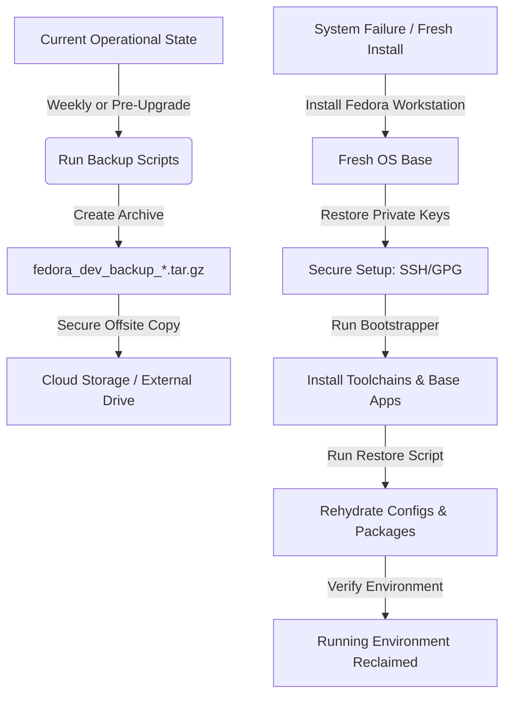

# Fedora Workstation Disaster Recovery & Restoration Plan

This document outlines the workflow and procedures required to back up your current Fedora configuration and restore it from scratch in the event of system failure, hardware replacement, or OS reinstallation.

---

## 📋 Disaster Recovery Lifecycle Overview

To ensure you can recover your workstation in under an hour, follow this lifecycle:



---

## 💾 Phase 1: The Backup Workflow (Keeping Files Safe)

A full backup consists of two parts:
1. **Application manifests and dotfiles** (unclassified, automated via `export-config.sh`).
2. **Secret keys and identities** (highly sensitive, must be handled manually and securely).

### 1. Automated Configuration Export
The `scripts/export-config.sh` script automatically packages:
* **System packages**: DNF, Pipx tools, Flatpaks, VSCodium extensions.
* **Configurations**: Shell dotfiles (`.bashrc`, `.zshrc`), git settings (`.gitconfig`), SSH connection maps (`.ssh/config`), VSCodium preferences (`settings.json`).

Run the backup script:
```bash
cd ~/github/fedora-dev-setup
./scripts/export-config.sh
```
* **Output archive**: `~/fedora-backups/fedora_dev_backup_YYYYMMDD_HHMMSS.tar.gz`

### 2. Manual Backup of Sensitive Identities
For security reasons, **private keys are excluded from the automated backup archive**. You must backup your SSH and GPG keys separately to an encrypted medium (such as an encrypted USB drive or password manager vault).

#### SSH Keys backup:
```bash
# Copy entire .ssh directory (excluding config if already captured)
cp -r ~/.ssh /run/media/user/YOUR_SECURE_DRIVE/backups/ssh_backup/
```

#### GPG Keys backup (if applicable):
```bash
# Export private keys in ASCII armor format
gpg --export-secret-keys --armor "your_email@example.com" > /run/media/user/YOUR_SECURE_DRIVE/backups/gpg_private.key
gpg --export --armor "your_email@example.com" > /run/media/user/YOUR_SECURE_DRIVE/backups/gpg_public.key
```

### 3. Backup Repository Code
Ensure all active development projects under `~/github/` (or your projects folder) are pushed to remote hosts (GitHub, GitLab).
For untracked files or stash items, copy them manually to your secure drive:
```bash
rsync -av --exclude='.git' ~/github/ /run/media/user/YOUR_SECURE_DRIVE/projects/
```

### 4. Storage Guidelines
* **Primary location**: Local disk (`~/fedora-backups/`).
* **Secondary location**: Copy the latest `.tar.gz` and secret keys directory to a **physical secondary storage device** (external SSD/USB) OR an **encrypted cloud directory** (e.g., Proton Drive, Cryptomator on Google Drive).
* **Retention**: Keep at least the 3 most recent backups.

---

## ⚡ Phase 2: The Restoration Workflow (Rebuilding After Failure)

In the event of a system wipe, follow these steps to return to your current operational state:

### Step 1: Fresh OS Installation
1. Download the latest Fedora Workstation ISO and write it to a USB drive.
2. Install Fedora Workstation.
   > [!IMPORTANT]
   > Use the exact same **username** during installation (e.g. `user`). This ensures absolute path alignment for configurations (`/home/user/`) and avoids permission/path issues.

### Step 2: Restore SSH and GPG Credentials
Do not start cloning repositories until you have restored your keys and authorized your machine:
1. Mount your secure backup drive.
2. Copy SSH credentials back to your new `$HOME`:
   ```bash
   mkdir -p ~/.ssh
   cp -r /run/media/user/YOUR_SECURE_DRIVE/backups/ssh_backup/* ~/.ssh/
   chmod 700 ~/.ssh
   chmod 600 ~/.ssh/*
   chmod 644 ~/.ssh/*.pub
   ```
3. Import GPG keys (if applicable):
   ```bash
   gpg --import /run/media/user/YOUR_SECURE_DRIVE/backups/gpg_private.key
   ```

### Step 3: Clone the Provisioning Tool
With SSH restored, you can securely clone the setup repository:
```bash
mkdir -p ~/github
cd ~/github
git clone git@github.com:KnowOneActual/fedora-dev-setup.git
cd fedora-dev-setup
```

### Step 4: Run the System Bootstrapper
Run the interactive script to install the toolchains (Python, Node, Go, Rust), graphics drivers, and desktop container runtimes:
```bash
sudo ./bootstrap-fedora.sh
```
* Select **Option 1 [INSTALL]** from the interactive menu.
* The script will detect your hardware chassis (laptop vs. desktop) and GPU type (NVIDIA vs. AMD) and optimize the environment.

### Step 5: Restore Packages, Desktop Settings, and Profiles
You can restore your personal environment directly through the bootstrapper menu, or run it via the command line:

#### Option A: Interactive Menu (Recommended)
1. Run the bootstrapper:
   ```bash
   ./bootstrap-fedora.sh
   ```
2. Select **Option 5 [RESTORE]**.
3. The script will scan `~/fedora-backups/` and display a list of found backups. Enter the number corresponding to your backup to restore it.

#### Option B: Command Line Arguments
Alternatively, run the restore command directly:
```bash
# Sudo not required unless restoring system packages; the script elevates when needed.
# Auto-discover or prompt for backup:
./bootstrap-fedora.sh --restore

# Or specify a direct backup archive file:
./bootstrap-fedora.sh --restore /path/to/fedora_dev_backup_YYYYMMDD_HHMMSS.tar.gz
```

#### What is restored?
The restore system will:
* **Resilient DNF Package Restore**: Re-installs DNF package additions using a best-effort transaction. If a package is missing from standard repositories, the script isolates and installs remaining packages without crashing.
* **Flatpak Applications**: Re-installs Flatpak software selections from Flathub.
* **Pipx Command-Line Tools**: Restores Python packages.
* **VSCodium Setup**: Restores preferences and automatically re-installs extensions.
* **Shell & Core Configs**: Restores `.bashrc`, `.zshrc`, `.zprofile`, `.profile`, `.gitconfig`, and `.tmux.conf` to your home directory.
* **Zsh Custom Extensions**: Copies back `~/.config/zsh-custom` to preserve custom prompt additions/aliases.
* **GNOME & Desktop Settings**: Uses `dconf` to restore all keybindings, desktop layouts, and UI customizations.
* **Permission Alignment**: Ensures all restored files are correctly owned by the actual user and not root.

### Step 6: Post-Restoration Verification
Validate that everything is configured correctly:
```bash
# Run the built-in validator (No sudo required)
./bootstrap-fedora.sh --validate
```
Verify that:
1. Shell is set to Zsh and theme loads correctly.
2. Git can authenticate: `ssh -T git@github.com`
3. Dev environments are fully functional (`python --version`, `node --version`, `rustc --version`, `docker ps`).
4. Custom shell aliases, tmux settings, and GNOME custom shortcuts are applied.

---

## 🔄 Recommendations for Automation

To ensure backups are never forgotten, consider implementing these strategies:

### 1. Automated Weekly Backup Reminder / Job
You can configure a simple user-level Cron job to run the export-config script weekly:
```bash
crontab -e
```
Add the following line to run backups every Friday at 5:00 PM:
```text
0 17 * * 5 /home/user/github/fedora-dev-setup/scripts/export-config.sh >/dev/null 2>&1
```

### 2. Encrypting Secrets for Cloud Storage
If you want to keep your SSH keys backed up in the cloud, never upload them raw. Encrypt the directory using GPG symmetric encryption:
```bash
# Encrypt and compress secrets
tar -czf - -C ~ .ssh | gpg -c -o ~/fedora-backups/ssh_secrets_backup.tar.gz.gpg
```
To restore:
```bash
# Decrypt and extract secrets
gpg -d ~/fedora-backups/ssh_secrets_backup.tar.gz.gpg | tar -xzf - -C ~
```
